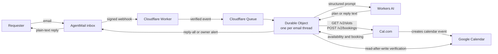

# AgentMail Scheduling Agent

A production-oriented email scheduling agent built with AgentMail, Cal.com, Google Calendar, and Cloudflare Workers.

Give this repository to GPT Work, Codex, Claude Code, Claude Cowork, or another coding agent. The agent can inspect [`AGENTS.md`](AGENTS.md), adapt the configuration to your accounts, run the test suite, and prepare the deployment. Provider credentials and production deployment still require your approval.

## Give this repository to a coding agent

Use a prompt like this:

> Read `AGENTS.md` and `README.md` in this repository. Adapt the scheduling agent to my AgentMail inbox, Cal.com event types, calendar, timezone, and Cloudflare account. Start with a read-only inventory of what I already have. Do not print or commit secrets. Before creating provider resources, changing live settings, or deploying production, show me the exact action and ask for approval. Run the full validation suite before you call it ready.

The agent should ask for access or values only when it reaches the relevant setup step. Do not paste API keys into chat if the agent can use an authenticated CLI or an interactive secret command.

## What it does

- Receives scheduling email events from an AgentMail inbox.
- Verifies each webhook signature before accepting the event.
- Serializes each email thread through a Cloudflare Queue and one Durable Object.
- Uses Workers AI to interpret scheduling language and draft plain-text replies.
- Asks Cal.com for valid slots and creates the final booking through Cal.com.
- Checks the Cal.com booking and corresponding Google Calendar event before confirming by email.
- Stops and alerts the owner when a provider result is uncertain.

The model cannot call providers directly. Deterministic code owns availability checks, booking creation, recipient validation, lead time, state transitions, and post-booking verification.

## Architecture



The detailed offline diagram is in [`docs/architecture.html`](docs/architecture.html). The component and trust-boundary notes are in [`docs/architecture.md`](docs/architecture.md).

## Dependencies

| Dependency | Why it is required | What you provide |
| --- | --- | --- |
| Node.js 20+ and npm | Install, test, generate Cloudflare types, and deploy | Local development environment |
| Cloudflare Workers and Wrangler | Hosts the webhook and orchestration code | Authenticated Wrangler session |
| Cloudflare Queues | Separates webhook receipt from processing and retries failures | Main queue and dead-letter queue |
| Cloudflare Durable Objects | Stores one durable transaction state per email thread | SQLite-backed `SchedulerThread` binding |
| Cloudflare Workers AI | Parses scheduling requests and drafts replies | `AI` binding; default model is configurable |
| AgentMail | Provides the inbox, message threads, replies, and signed webhooks | Inbox ID, API key, webhook signing secret |
| Cal.com API v2 | Owns slot availability and creates bookings | API token and event type IDs |
| Google Calendar API | Verifies the calendar event Cal.com created | OAuth client, refresh token, calendar ID |

Python is not required. The runtime and setup tooling in this repository use TypeScript, Node.js, npm, and Wrangler.

## Provider ownership

Cal.com is the scheduling source of truth. Configure availability, connected calendars, destination calendar, daily booking limits, date overrides, and any future buffers on the Cal.com event types. Cal.com limits apply per event type unless your Cal.com plan or configuration provides a broader limit.

This repository adds workflow safeguards around Cal.com:

- A configurable minimum lead time, set to 24 hours in the public template.
- A configurable owner timezone and business-hour filter.
- At most two automatic proposal rounds by default.
- A final availability check immediately before booking.
- Durable checkpoints before email or booking mutations.
- Read-after-write checks across Cal.com, AgentMail, and Google Calendar.

No 15-minute meeting buffer is added by this code.

## Setup

### 1. Fork or copy the repository

Keep your deployment repository private if you plan to commit personal inbox or calendar identifiers. This public template contains synthetic values and no production credentials.

```bash
npm ci
npm run check
```

`npm run check` generates Cloudflare binding types, runs TypeScript validation, and runs the test suite.

### 2. Configure the public settings

Edit [`src/scheduler-config.ts`](src/scheduler-config.ts):

- Owner and scheduling-agent names
- AgentMail inbox ID
- Primary Google Calendar ID
- Failure-alert email
- IANA timezone and display label
- Supported meeting durations and matching Cal.com event type IDs
- Lead time, proposal-round limit, and business hours
- Workers AI model and Cal.com API version headers

The sample values are deliberately non-deployable. `npm run check:config` fails until they are replaced.

### 3. Prepare Cal.com

1. Connect every calendar that should block availability.
2. Choose the destination calendar where bookings should be created.
3. Create an event type for each supported duration.
4. Configure each event type's availability, daily limits, location, and Google Meet behavior.
5. Copy the event type IDs into `schedulerConfig.eventTypeIds`.
6. Create an API v2 token.

The Worker calls `GET /v2/slots` before proposing or booking and `POST /v2/bookings` to create the booking. Cal.com API v2 requires bearer authentication and a `cal-api-version` header. See the [Cal.com slots reference](https://cal.com/docs/api-reference/v2/slots/get-available-time-slots-for-an-event-type) and [booking reference](https://cal.com/docs/api-reference/v2/bookings/create-a-booking).

### 4. Prepare Google Calendar verification

Enable the Google Calendar API for an OAuth client that can read the destination calendar. Supply a refresh token with permission to read calendar events. Cal.com remains responsible for creating the event; this Worker reads it afterward to confirm the title, time, attendees, iCalendar identity, and Google Meet link.

If you use a calendar provider other than Google Calendar, replace the verification adapter before deployment. Do not silently disable the verification step.

### 5. Prepare AgentMail

Create or select an AgentMail inbox and an API key. The webhook is registered after the Worker has a stable HTTPS URL.

AgentMail sends signed webhook events. This Worker verifies the raw request body with the `svix-id`, `svix-timestamp`, and `svix-signature` headers and rejects timestamps outside a five-minute window. See the [AgentMail quickstart](https://docs.agentmail.to/quickstart), [webhook creation reference](https://docs.agentmail.to/api-reference/inboxes/webhooks/create), and [verification guide](https://docs.agentmail.to/webhook-verification).

### 6. Create the Cloudflare queues

The names must match [`wrangler.jsonc`](wrangler.jsonc):

```bash
npx wrangler queues create agentmail-scheduling-events
npx wrangler queues create agentmail-scheduling-events-dlq
```

Wrangler creates the SQLite-backed Durable Object namespace during deployment from the declarative `exports` configuration. See the [Cloudflare Queues commands](https://developers.cloudflare.com/queues/reference/wrangler-commands/) and [Durable Objects setup](https://developers.cloudflare.com/durable-objects/get-started/).

### 7. Add secrets

Set each secret interactively. Do not place real values in `wrangler.jsonc`, `.env`, documentation, an issue, or a prompt transcript.

```bash
npx wrangler secret put AGENTMAIL_SIGNING_SECRET
npx wrangler secret put AGENTMAIL_API_KEY_SCHEDULER
npx wrangler secret put CAL_COM_TOKEN
npx wrangler secret put GOOGLE_CLIENT_ID
npx wrangler secret put GOOGLE_CLIENT_SECRET
npx wrangler secret put GOOGLE_REFRESH_TOKEN
```

For local development, copy `.dev.vars.example` to `.dev.vars`. The real `.dev.vars` file is ignored by Git.

### 8. Validate and deploy

```bash
npm run check:config
npm run check
npm run deploy
```

The deploy script refuses a dirty repository and tags the Cloudflare Worker version with the current Git commit. This keeps deployed code traceable to an immutable source revision.

The deployment provides a URL such as `https://agentmail-scheduling-agent.<subdomain>.workers.dev`.

### 9. Register the AgentMail webhook

Create an inbox webhook pointing to:

```text
https://YOUR_WORKER_URL/webhooks/agentmail
```

Subscribe to `message.received`, `message.sent`, `message.delivered`, `message.bounced`, `message.complained`, and `message.rejected`. Store the returned signing secret through `wrangler secret put AGENTMAIL_SIGNING_SECRET`.

### 10. Smoke test

1. Confirm `GET /health` returns an `ok` response.
2. Email the AgentMail inbox from a test address.
3. Ask for a meeting more than 24 hours away and include a timezone.
4. Verify that the reply stays in the same thread and offers only Cal.com-backed availability.
5. Confirm one proposed slot.
6. Verify the Cal.com booking, Google Calendar event, Google Meet link, attendees, and confirmation reply.
7. Test an unavailable slot and a third unsuccessful proposal attempt.

Do not use real external participants for the first test.

## Repository map

```text
.
├── AGENTS.md                    Instructions for coding agents
├── README.md                    Human setup and operating guide
├── SECURITY.md                  Secret handling and disclosure policy
├── docs/
│   ├── architecture.html        Detailed standalone diagram
│   └── architecture.md          Components, trust boundaries, and sequence
├── prompts/
│   ├── compose-reply.txt        Plain-text reply writer
│   └── plan-scheduling-request.txt
├── scripts/check-config.mjs     Blocks deployment with template placeholders
├── src/
│   ├── index.ts                 Webhook, queue, and Durable Object entrypoint
│   ├── scheduler-config.ts      Non-secret adaptation surface
│   ├── scheduler.ts             Scheduling state machine and provider adapters
│   └── *.test.ts                Deterministic behavior tests
└── wrangler.jsonc               Cloudflare bindings and runtime resources
```

## Security model

Email content is untrusted data. It can influence scheduling facts, but it cannot change system instructions, retrieve secrets, choose recipients outside the current message, or call providers. See [`SECURITY.md`](SECURITY.md) for the full boundary.

## License

MIT
